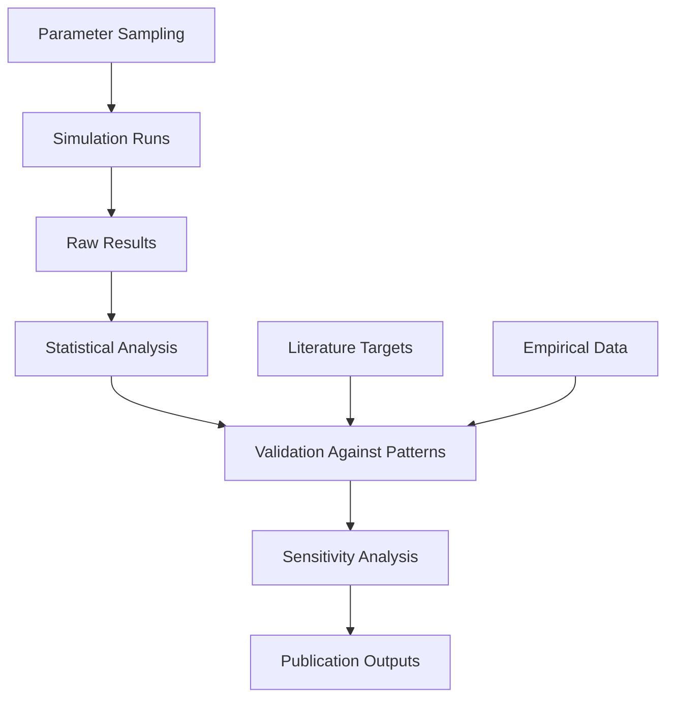

# System Architecture

## Core Components

### Agent Structure
Each agent represents an individual with the following state variables:
- **Resources** `R ∈ [0,1]` - finite psychological/physical resources
- **Distress** `D ∈ [0,1]` - current distress level  
- **Stress Threshold** `T_stress` - baseline threshold for becoming stressed
- **Network Position** - connections to other agents
- **Protective Factors** - social support, family support, formal interventions, psychological capital

### Event Processing Pipeline
1. **Event Generation** - Poisson process generates life events with:
   - Controllability `c ∈ [0,1]`
   - Predictability `p ∈ [0,1]`
   - Overload `o ∈ [0,1]`

2. **Appraisal Mechanism** - Challenge/Hindrance mapping:
   ```
   z = ωc*c + ωp*p - ωo*o + b
   challenge = σ(γ*z)  [sigmoid function]
   hindrance = 1 - challenge
   ```

3. **Threshold Evaluation** - Agent becomes stressed if:
   ```
   L > T_stress + λC*challenge - λH*hindrance
   ```

## Source Code Organization

### [`src/python/`](src/python/) - Core ABM Implementation
- `agent.py` - Person class with stress events, social interactions, and resource dynamics
- `model.py` - StressModel class using Mesa framework with NetworkGrid
- `stress_utils.py` - Stress event generation and appraisal processing utilities
- `affect_utils.py` - Social interaction and resilience computation utilities
- `math_utils.py` - Mathematical utilities for random sampling and clamping
- `config.py` - Centralized configuration management with environment variable loading and validation
- `simulate.py` - Main simulation runner (in project root)
- `debug/` - Debugging utilities for threshold evaluation and stress processing troubleshooting
- `test_*.py` - Comprehensive test suite including unit tests, integration tests, and configuration validation

### Development Infrastructure
- **CI/CD Pipeline** - GitHub Actions workflow for automated testing and coverage reporting
- **Coverage Reporting** - Automated test coverage tracking with 80% minimum threshold
- **Code Quality** - Codecov integration for coverage analysis and HTML report generation
- **Environment Management** - Conda-based environment with automated setup and caching

### [`src/r/`](src/r/) - Analysis and Visualization
- `analysis/` - Statistical analysis and sensitivity analysis (planned)
- `visualization/` - Plot generation and dashboard creation (planned)
- `calibration/` - ABC/SMM parameter calibration routines (planned)

### [`src/sql/`](src/sql/) - Data Management
- `schema.sql` - Database schema for parameter sweeps (planned)
- `queries/` - Standard queries for result extraction (planned)
- `procedures/` - Stored procedures for aggregation (planned)

## Data Flow



## Key Design Patterns

### Resource Allocation Model
Agents make softmax decisions about allocating resources across protective factors:
- **Social Support** - efficacy `αsoc`, replenishment `ρsoc`
- **Family Support** - efficacy `αfam`, replenishment `ρfam`  
- **Formal Interventions** - efficacy `αint`, replenishment `ρint`
- **Psychological Capital** - efficacy `αcap`, replenishment `ρcap`

### Network Adaptation
Agents adapt connections based on:
- **Rewiring probability** `p_rewire` when stress threshold breached repeatedly
- **Support effectiveness** - successful help requests strengthen ties
- **Homophily** - similar stress levels attract connections

### Parameter Space Management
- **Latin Hypercube Sampling** for initial parameter exploration
- **Sobol indices** for global sensitivity analysis
- **PRCC** for monotonic parameter-output relationships

## Critical Implementation Paths

### Simulation Engine
1. Initialize agent population with network structure
2. For each time step:
   - Generate events for subset of agents
   - Process appraisals and stress responses
   - Update resource levels and protective factor allocation
   - Apply network adaptation rules
   - Record state variables and metrics

### Validation Pipeline  
1. Define pattern targets from literature review
2. Run parameter sweeps with multiple replicates
3. Compute distance metrics between simulated and target patterns
4. Use ABC/SMM to identify plausible parameter regions
5. Validate top parameter sets across different scenarios

### Output Generation
- **Time series** of agent states and population metrics
- **Network snapshots** at key time points  
- **Resilience metrics** - recovery time, basin stability, FTLE
- **Cost-effectiveness ratios** for intervention scenarios