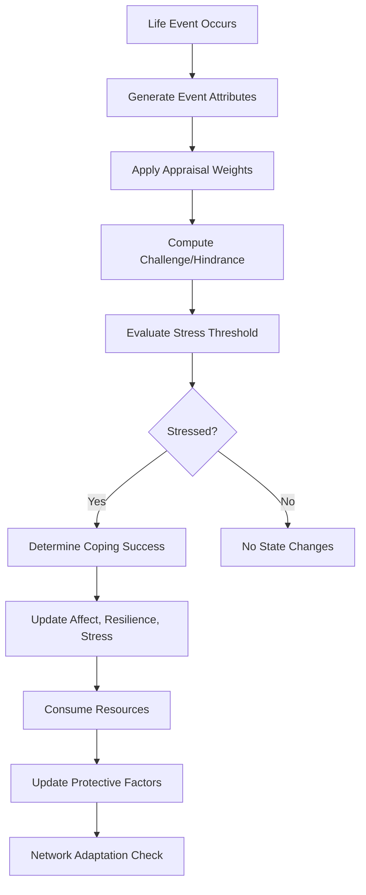
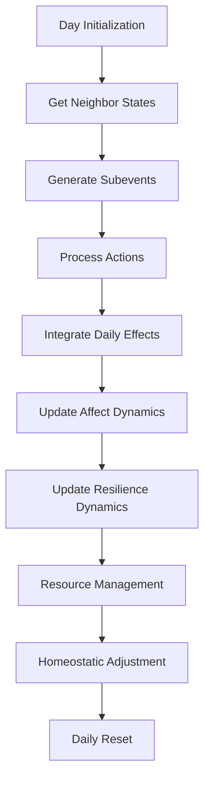

# Integration Overview: How All Mechanisms Work Together

## System Architecture Overview

The agent-based model integrates five core mechanism groups that work together to simulate realistic mental health dynamics:

1. **Stress Perception** - Event appraisal and challenge/hindrance determination
2. **Resilience Dynamics** - Coping responses and resilience changes
3. **Affect Dynamics** - Emotional state changes and social influence
4. **Agent Interactions** - Social network effects and support systems
5. **Resource Management** - Protective factors and resource allocation

## Core Integration Pathways

### Stress Event Processing Pipeline



**Integration Points**:
- **Stress → Affect**: Challenge/hindrance directly influence affect
- **Stress → Resilience**: Coping outcomes determine resilience changes
- **Stress → Resources**: Successful coping consumes resources
- **Stress → Network**: High stress triggers network adaptation

### Daily Step Integration



## Cross-System Feedback Loops

### Positive Feedback Loop: Success Reinforcement

```
High Resilience → Better Coping → Positive Affect → Resource Regeneration → Higher Resilience
     ↑                                                                      ↓
     └── Social Support ← Network Effects ← Challenge Events ← Stress Events ───┘
```

**Mechanism**:
1. High resilience improves coping success probability
2. Successful coping with challenge events boosts affect positively
3. Positive affect accelerates resource regeneration
4. More resources enable better protective factor investment
5. Strong protective factors enhance resilience

### Negative Feedback Loop: Stress Degradation

```
Low Resilience → Poor Coping → Negative Affect → Resource Depletion → Lower Resilience
     ↑                                                                             ↓
     └── Social Withdrawal ← Network Effects ← Hindrance Events ← Stress Events ───┘
```

**Mechanism**:
1. Low resilience reduces coping success probability
2. Failed coping with hindrance events creates negative affect
3. Negative affect slows resource regeneration
4. Resource depletion limits protective factor investment
5. Weak protective factors further reduce resilience

### Social Amplification Loop

```
Positive Neighbors → Social Support → Better Coping → Positive Affect → Better Neighbors
     ↑                                                                              ↓
     └── Network Adaptation ← Similar Agents ← Homophily ← Stress Patterns ─────────┘
```

**Mechanism**:
1. Positive neighbor affect provides social support
2. Social support improves coping success
3. Successful coping creates positive affect
4. Similar affect patterns drive homophily in network adaptation
5. Network adaptation connects agents with similar stress experiences

## Temporal Integration Patterns

### Within-Day Dynamics

**Subevent Sequencing**:
```python
# Each day: 5-10 random subevents
actions = random_mixture(["interact", "stress"], n_subevents)

# Order matters: social interactions can buffer stress effects
if social_interaction_before_stress:
    coping_probability += social_buffering_effect
```

**Accumulation Effects**:
- **Daily Challenge/Hindrance**: Averaged across all stress events
- **Social Influence**: Accumulated from all interactions
- **Resource Consumption**: Summed across coping attempts

### Day-to-Day Dynamics

**Carryover Effects**:
```python
# Consecutive hindrance tracking
if hindrance_dominant_event:
    consecutive_hindrances += 1
else:
    consecutive_hindrances = 0

# Overload triggers after threshold
if consecutive_hindrances >= overload_threshold:
    resilience_penalty = 0.2 * (consecutive_hindrances / 10)
```

**Homeostatic Regulation**:
```python
# Daily pull toward baseline
affect_adjustment = homeostatic_rate * (baseline_affect - current_affect)
resilience_adjustment = homeostatic_rate * (baseline_resilience - current_resilience)

# Stress decay over time
stress_level *= (1 - daily_decay_rate)
```

## Network Integration Effects

### Spatial Stress Propagation

**Grid-Based Contagion**:
```python
# Stress spreads through local neighborhoods
for neighbor in grid_neighbors:
    if neighbor.stress_level > threshold:
        contagion_probability = distance_decay * neighbor.stress_level
        if random() < contagion_probability:
            self.stress_level += contagion_effect
```

**Clustering Emergence**:
- **High-Stress Clusters**: Form around agents with chronic hindrance events
- **Low-Stress Clusters**: Form around agents with effective coping strategies
- **Mixed Areas**: Show gradient effects between different stress levels

### Support Network Formation

**Preferential Attachment**:
```python
# Effective supporters attract more connections
if support_effectiveness > threshold:
    connection_probability += effectiveness_bonus

# Network adaptation based on support history
if historical_support_success > 0.7:
    strengthen_connection()
elif historical_support_success < 0.3:
    weaken_or_rewire_connection()
```

## Resource Allocation Integration

### Protective Factor Investment

**Dynamic Allocation**:
```python
# Allocation based on current needs and efficacy
allocation_weights = softmax(current_efficacy / temperature)

# Investment return depends on current state
improvement_rate = base_rate * (1 - current_efficacy) * need_multiplier
new_efficacy = current_efficacy + investment * improvement_rate
```

**Cross-System Resource Flow**:
- **Stress Events**: Consume resources for coping
- **Social Interactions**: May consume resources for support provision
- **Regeneration**: Influenced by affect state
- **Investment**: Allocates resources to protective factors

## Configuration System Integration

### Unified Parameter Management

**Centralized Configuration**:
```python
# All mechanisms use the same configuration system
config = get_config()

# Affect dynamics parameters
affect_config = AffectDynamicsConfig()
resilience_config = ResilienceDynamicsConfig()
stress_config = StressProcessingConfig()
interaction_config = InteractionConfig()
```

**Parameter Categories**:
- **Agent Parameters**: Initial states, baseline levels, behavioral rates
- **Stress Parameters**: Event generation, appraisal weights, threshold scaling
- **Affect Parameters**: Influence rates, homeostatic rates, appraisal effects
- **Resilience Parameters**: Coping rates, support effects, overload thresholds
- **Network Parameters**: Grid size, neighbor limits, adaptation rates
- **Resource Parameters**: Regeneration rates, allocation costs, protective efficacy

## Validation Integration

### Multi-Level Validation

**Individual Agent Validation**:
- **Stress Response**: Appropriate challenge/hindrance sensitivity
- **Coping Success**: Realistic success rates given challenge/hindrance
- **Affect Dynamics**: Proper response to social and stress influences
- **Resource Management**: Sustainable resource levels over time

**Population-Level Validation**:
- **Stress Distribution**: Realistic distribution of stress levels
- **Network Structure**: Appropriate clustering and connectivity
- **Intervention Effects**: Measurable impact of protective factors
- **Emergent Patterns**: Realistic mental health outcome distributions

**Literature Alignment**:
- **PSS-10 Scores**: Match empirical stress scale distributions
- **Recovery Times**: Align with psychological recovery literature
- **Social Effects**: Consistent with social influence research
- **Intervention Efficacy**: Match mental health intervention studies

## Research Pipeline Integration

### Parameter Sweep Integration

**Multi-Mechanism Sensitivity**:
```python
# Sensitivity analysis across integrated parameters
sweep_parameters = {
    'stress': ['omega_c', 'omega_p', 'omega_o', 'lambda_C', 'lambda_H'],
    'affect': ['peer_influence_rate', 'homeostatic_rate', 'event_appraisal_rate'],
    'resilience': ['coping_success_rate', 'social_support_rate', 'challenge_bonus'],
    'network': ['rewire_probability', 'homophily_strength', 'adaptation_threshold']
}

# Integrated sensitivity analysis
for param_set in parameter_combinations:
    run_simulation_with_parameters(param_set)
    validate_against_pattern_targets()
    compute_sensitivity_indices()
```

### Output Integration

**Multi-Level Metrics**:
```python
# Individual agent metrics
agent_metrics = {
    'stress_history': daily_stress_levels,
    'affect_trajectory': daily_affect_values,
    'resilience_path': daily_resilience_values,
    'coping_success_rate': overall_coping_success,
    'social_integration': network_connections
}

# Population metrics
population_metrics = {
    'stress_distribution': population_stress_levels,
    'affect_clusters': spatial_affect_patterns,
    'resilience_distribution': population_resilience_levels,
    'network_structure': clustering_coefficients,
    'intervention_effects': pre_post_comparisons
}
```

## Intervention Integration

### Multi-Tiered Intervention Effects

**Universal Interventions**:
- **Population-wide**: Affect all agents equally
- **Mechanism**: Modify base parameters (e.g., increase coping_success_rate)
- **Integration**: Applied through configuration system

**Selective Interventions**:
- **Targeted Groups**: Applied to specific agent subgroups
- **Mechanism**: Condition-based parameter modification
- **Integration**: Runtime parameter adjustment based on agent characteristics

**Indicated Interventions**:
- **Individual Treatment**: Applied to agents meeting clinical criteria
- **Mechanism**: State-based intervention triggering
- **Integration**: Real-time intervention based on stress/resilience thresholds

## Mathematical Integration Framework

### State Vector Integration

**Complete Agent State**:
```
S_t = [A_t, R_t, S_t, P_t, N_t, R_t]
```

Where:
- `A_t`: Affect state at time t
- `R_t`: Resilience state at time t
- `S_t`: Stress state at time t
- `P_t`: Protective factors state at time t
- `N_t`: Network state at time t
- `R_t`: Resources state at time t

**State Transition Function**:
```
S_{t+1} = F(S_t, E_t, I_t, C_t)
```

Where:
- `F`: Integration function combining all mechanisms
- `E_t`: External events at time t
- `I_t`: Interaction events at time t
- `C_t`: Configuration parameters

### Equilibrium Analysis

**Homeostatic Equilibria**:
```python
# System tends toward equilibrium points
equilibrium_affect = baseline_affect
equilibrium_resilience = baseline_resilience
equilibrium_stress = 0

# Stability depends on parameter settings
if social_influence_rate > homeostatic_rate:
    # Social effects dominate, multiple equilibria possible
    multiple_equilibria = true
else:
    # Homeostasis dominates, single equilibrium
    single_equilibrium = true
```

## Implementation Integration

### Code Organization Integration

**Modular Design**:
- **`stress_utils.py`**: Stress perception and appraisal mechanisms
- **`affect_utils.py`**: Affect dynamics and social influence
- **`agent.py`**: Integration orchestration and state management
- **`model.py`**: Population-level coordination and grid management
- **`config.py`**: Unified parameter management across all systems

**Dependency Flow**:
```python
# Agent step() method integrates all mechanisms
def step(self):
    # 1. Initialize and get social context
    # 2. Process stress and social events
    # 3. Update affect dynamics
    # 4. Update resilience dynamics
    # 5. Manage resources and protective factors
    # 6. Apply homeostatic adjustments
    # 7. Reset daily tracking
```

### Testing Integration

**Comprehensive Test Coverage**:
- **Unit Tests**: Individual mechanism functions
- **Integration Tests**: Cross-mechanism interactions
- **Configuration Tests**: Parameter validation and type checking
- **Mechanism Tests**: Specific behavioral validations
- **Validation Tests**: Literature alignment and pattern matching

## Future Integration Extensions

### Planned Enhancements

**R Analysis Integration**:
- **Statistical Analysis**: Population-level pattern analysis
- **Visualization**: Dynamic network and state visualization
- **Calibration**: ABC/SMM parameter calibration routines

**SQL Database Integration**:
- **Large-Scale Storage**: Parameter sweep results and simulation outputs
- **Query Interface**: Efficient data extraction for analysis
- **Performance Optimization**: Batch processing capabilities

**Advanced Network Features**:
- **Dynamic Network Growth**: Agent population changes over time
- **Multi-Scale Networks**: Hierarchical social structures
- **Temporal Network Evolution**: Time-varying connection patterns

This integration framework ensures that all mechanisms work together cohesively while maintaining the modularity and testability required for rigorous research validation.